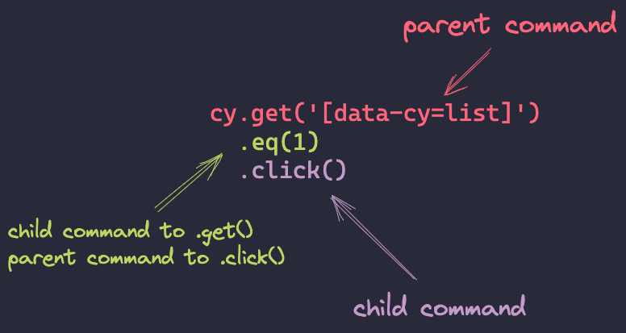

# Chaining & retry-ability

## Chaining
- every command passes information onto another
- commands have a parent/child relationship, and some behave differently depending on whether they are in parent position or child
- you can see what each command returns by looking into "Yielded" value inside the browser console

## Retry-ability
- this is one of the core concepts in Cypress. You might know this as "fluent-wait" if you are coming from Selenium
- by default, Cypress waits for 4000 milliseconds, but this can be adjusted in the command, test, or globally in `cypress.config.js` file
- `.should()` command will make the previous command retry, so think about that when you are testing something that might still render while your test is running

## Useful reading
* [my blog on how to avoid waiting in Cypress](https://filiphric.com/waiting-in-cypress-and-how-to-avoid-it)
* [docs on the topic of retry-ability](https://docs.cypress.io/guides/core-concepts/retry-ability)
* [docs about chaining commands](https://docs.cypress.io/guides/core-concepts/introduction-to-cypress#Chains-of-Commands)
* [how to write better command chains in Cypress](https://filiphric.com/writing-better-command-chains-in-cypress)
* [my blog on the topic of .contains() command](https://filiphric.com/contains-an-overlooked-gem-in-cypress)